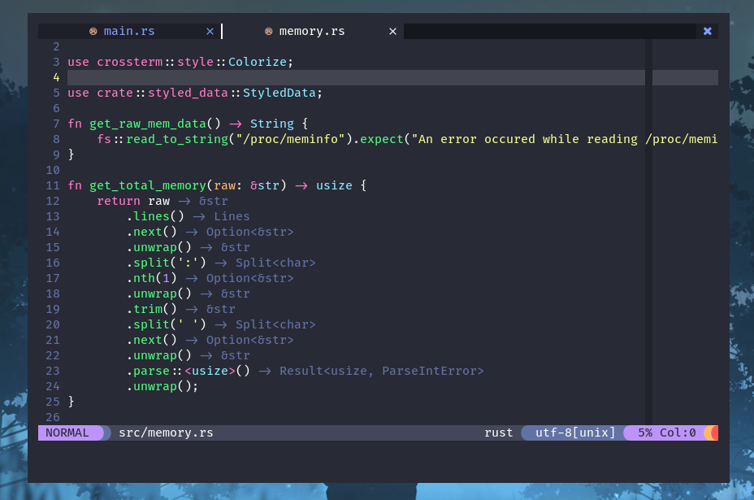
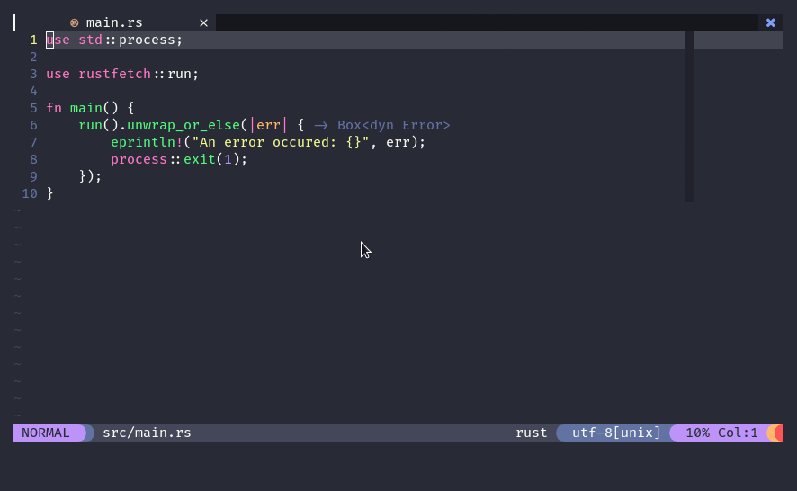
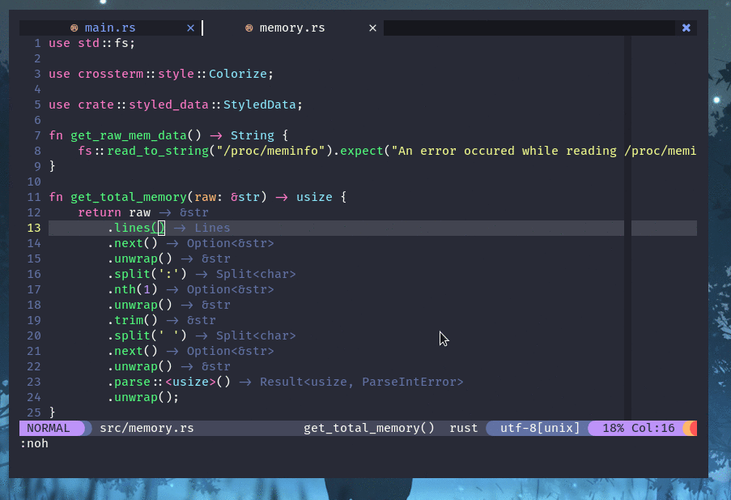
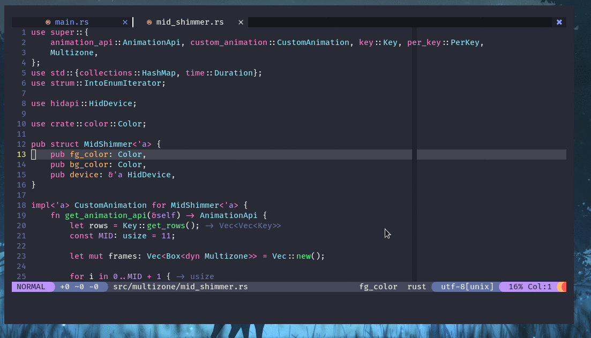

# rust-tools.nvim
Extra rust tools for writing applications in neovim using the native lsp.
This plugin adds extra functionality over rust analyzer. The features mirror VsCode.

# Inspiration

This plugin draws inspiration from [`akinsho/flutter-tools.nvim`](https://github.com/akinsho/flutter-tools.nvim)

## Prerequisites

- `neovim 0.5+` (nightly)
- `nvim-lspconfig`
- `rust-analyzer`

## Installation

using `vim-plug`

```vim
Plug 'neovim/nvim-lspconfig'
Plug 'simrat39/rust-tools.nvim'

" Optional dependencies
Plug 'nvim-lua/popup.nvim'
Plug 'nvim-lua/plenary.nvim'
Plug 'nvim-telescope/telescope.nvim'
```
<b>Look at the configuration information below to get started.</b>

# Configuration + Functionality

Please configure [`nvim-lspconfig for rust`](https://github.com/neovim/nvim-lspconfig/blob/master/CONFIG.md#rust_analyzer) before using this plugin.

This plugin is more of WYSIWYG right now but more configuration options will slowly be added.

### Initial setup
```lua
local opts = {
    -- automatically set inlay hints (type hints)
    -- There is an issue due to which the hints are not applied on the first
    -- opened file. For now, write to the file to trigger a reapplication of
    -- the hints or just run :RustSetInlayHints.
    -- default: true
    autoSetHints = true,
}

require('rust-tools').setup(opts)
```

## Commands
```vim
RustSetInlayHints
RustRunnables
RustRunnablesTelescope
RustExpandMacro
RustOpenCargo 
RustParentModule
RustJoinLines
RustHoverActions
RustMoveItemDown
RustMoveItemUp
```

#### Inlay Hints

```lua
-- Command:
-- RustSetInlayHints
require('rust-tools.inlay_hints').set_inlay_hints()
```

#### Runnables

```lua
-- Command:
-- RustRunnables
require('rust-tools.runnables').runnables()

-- Needs telescope.nvim
-- The theme part is optional
--
-- Command:
-- RustRunnablesTelescope
require('rust-tools.runnables').runnables_telescope(require('telescope.themes').get_dropdown({}))
```

#### Hover Actions

```lua
-- this needs the experimental hoverActions capability set
-- while configuring your rust-analyzer:
local capabilities = vim.lsp.protocol.make_client_capabilities()

capabilities.experimental = {}
capabilities.experimental.hoverActions = true

nvim_lsp.rust_analyzer.setup({
    capabilities = capabilities,
})
------------------------------------------------------------------
-- Actual call
-- Command:
-- RustHoverActions 
require'rust-tools.hover_actions'.hover_actions()
```

#### Expand Macros Recursively 

```lua
-- Command:
-- RustExpandMacro  
require'rust-tools.expand_macro'.expand_macro()
```

#### Open Cargo.toml

```lua
-- Command:
-- RustOpenCargo
require'rust-tools.open_cargo_toml'.open_cargo_toml()
```

#### Parent Module

```lua
-- Command:
-- RustParentModule 
require'rust-tools.parent_module'.parent_module()
```

#### Join Lines

```lua
-- Command:
-- RustJoinLines  
require'rust-tools.join_lines'.join_lines()
```